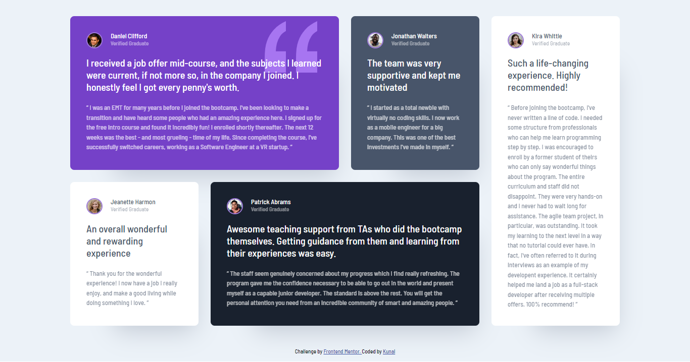

## Frontend Mentor - Testimonial grid section solution

> This is a solution to the [Testimonials grid section challenge on Frontend Mentor](https://www.frontendmentor.io/challenges/testimonials-grid-section-Nnw6J7Un7). Frontend Mentor challenges help you improve your coding skills by building realistic projects. 

### The Challenge

Users should be able to:
- View the optimal layout for the site depending on their device's screen size

### Buit with

- Semantic HTML5 Markup
- Custom CSS properties
- Flexbox
- CSS grid 
- Mobile first workflow

### Links

- Live Site URL: [Testimonial-grid-section](https://kunalbagnial.github.io/Testimonial-grid-section/)

### What I Learned

I learned how to achieve this particular layout in an easy manner using CSS grid. Also I learned how to position grid items using grid lines in a grid layout.

### Screenshots

